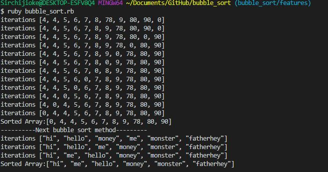

# bubble-sort-with-ruby
Microverse project 8 of 40
This is a demonstration of how bubble sort algorithm can be implemented in ruby
The aim of the project is to learn the basic methods and and syntax of Ruby programming language

## Built With

- Ruby
- Rubocop

### Prerequisites

- Ruby installation on the machine for windows OS
- Basic command line knowledge

### Setup

- Download or clone the repository
- Run a CLI and run `ruby bubble_sort.rb` on your local machine
- Alternatively, You can go to https://repl.it and select language ruby, copy paste the code, and run it.

## Author

👤 Ceejayski

- Github: [@Ceejayski](https://github.com/ceejayski)

- LinkedIn: [LinkedIn](https://www.linkedin.com/in/chijioke-okoli-b0397a168/)

Contributions, issues and feature requests are welcome!

## Show your support

Give a ⭐️ if you like this project!

## Acknowledgments

- Microverse
- GitHub
- Codecademy.com

## 📝 License

This project is [MIT](LICENSE) licensed.
This project is a collaboration project of microverse students. All rights are reserved for Ceejayski.
